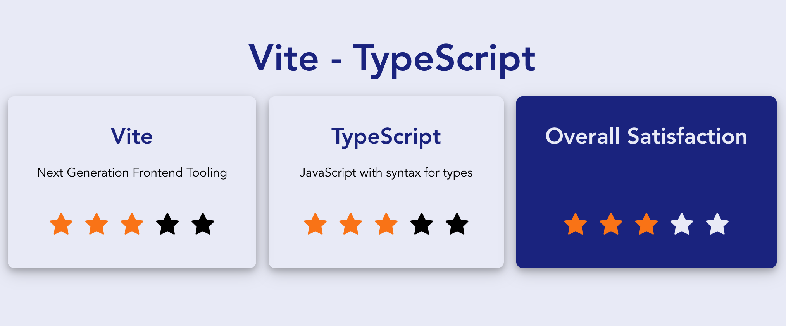

# @froko/create-vite-ts

A CLI to bootstrap new vite-based TypeScript projects. Rely on hand-crafted installation and configuration of the following products:

- vite.js
- TypeScript
- EsLint
- Prettier
- Visual Studio Code Extension recommendations
- Visual Studio Code settings (format & lint your code on save)
- TailwindCSS (optional)
- Lit (optional)
- React (optional)
- Vue.js (optional)
- Svelte (optional)
- Cypress.io (optional)
- Playwright (optional)
- Storybook (optional)
- Ladle (optional)
- Histoire (optional)

## Quick start

`npm init @froko/vite-ts@latest`

It will ask the following questions:

- Project name
- Template type
- Testing framework
- Component explorer

The CLI will create a new directory named by the project name.

## Available template types

- Vanilla Typescript
- Vanilla TypeScript with TailwindCSS
- Lit
- Lit with TailwindCSS
- React
- React with TailwindCSS
- Vue.js
- Vue.js with TailwindCSS
- Svelte
- Svelte with TailwindCSS

## Available testing frameworks

- Cypress.io
- Playwright
- None (if you don't want to benefit from e2e and component testing)

## Available component explorers

- Storybook
- Ladle (only React)
- Histoire (only Vue.js and Svelte)
- None (if you don't want to benefit from isolated component visualization)

## npm scripts

### Available in all templates:

- `npm run dev`: Starts the application at http://localhost:3000
- `npm run build`: Builds the application into the `dist` folder
- `npm run preview`: Serves the built application at http://localhost:3000

### Only available with Cypress.io option:

- `npm run cypress`: Starts the application & runs Cypress.io in visual mode
- `npm run cypress:ci`: Builds and serves the application & runs Cypress.io in headless mode

### Only available with Playwright option:

- `npm run playwright`: Runs your playwright e2e tests in different headless browsers
- `npm run playwright:ct`: Runs your playwright component tests in different headless browsers
- `npm run playwright:report`: Shows the Playwright HTML report of the last test run

### Only available with Storybook option:

- `npm run storybook`: Starts Storybook at http://localhost:6006

### Only available with Ladle option:

- `npm run ladle`: Starts Ladle at http://localhost:61000

### Only available with Histoire option:

- `npm run histoire`: Starts Histoire at http://localhost:6006

## Sample application

All templates provide a simple rating app. While building this product, I wanted to have something more than just a Click-Counter-Button to showcase the capabilities of web components together with sophisticated testing (Cypress.io, Playwright) and visualization (Storybook, Ladle, Histoire).

The rating app looks like this:

Feel free to delete all the sample application related code in the `src` folder and start over with your own project!

## What's next?

- Include solidjs templates
- Include Angular templates
- ...
